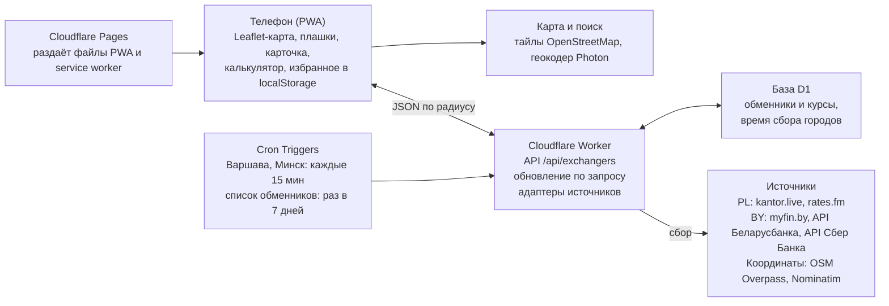

# Карта обменников — спецификация MVP

Версия от 08.10.2026 · автор: Софья

## Цель и рамки MVP

Приложение показывает на карте обменники вокруг пользователя с текущим курсом выбранной валюты и подсвечивает, где выгоднее всего купить или продать прямо сейчас.

- **Для кого:** личное использование, автор и друзья. Не публичный продукт.
- **Страны MVP:** Польша (стационарные kantory) и Беларусь (обменные пункты банков). Все города, которые есть у источников данных.
- **Платформа:** PWA, ставится на главный экран на Android и iPhone. Магазины приложений и APK не нужны.
- **Язык интерфейса:** только русский. Все тексты вынесены в отдельный файл локализации, чтобы позже добавить польский.
- **Главное ограничение:** только бесплатные ресурсы (хостинг, карты, геокодер, хранилище, сбор данных).

## Пользовательские сценарии

1. **Обменять рядом.** Открываю приложение на улице в Варшаве. Карта центрируется на мне, вокруг радиус 500 м. На плашках курс покупки USD у открытых kantorów, лучший подсвечен зелёным. Тапаю на него, нажимаю «Маршрут» и иду.
2. **Посчитать сумму.** В карточке обменника ввожу «500 $» и вижу, сколько это будет стоить в злотых именно здесь.
3. **Посмотреть заранее в другом городе.** Сижу в Варшаве, ввожу в поиске «Минск, вокзал». Карта прыгает туда, вижу отделения банков с курсами USD в BYN.
4. **Сменить валюту и направление.** Переключаю валюту на EUR, режим на «Продаю». Плашки и подсветка лучшего пересчитываются.
5. **Рядом ничего нет.** На окраине в 500 м нет открытых обменников. Приложение само расширяет радиус до 1 км и пишет об этом.
6. **Ночью.** Все обменники рядом закрыты. Приложение предлагает показать закрытые. Включаю, вижу их бледными с подписью «откроется в 9:00».
7. **Мой kantor.** Отмечаю звёздочкой обменник, где обычно меняю. Потом открываю список «Избранное» и сразу вижу его текущий курс.

## Функциональные требования

Каждое требование имеет номер FR-N, чтобы на него можно было ссылаться в задачах и коммитах.

### Карта и местоположение

- **FR-1.** При открытии приложение запрашивает геолокацию и центрирует карту на пользователе. Точка пользователя показана на карте.
- **FR-2.** Если доступ к геолокации запрещён или не получен за 10 секунд, карта открывается на последнем просмотренном месте, а при первом запуске на центре Варшавы. Показывается подсказка, как включить геолокацию.
- **FR-3.** Вокруг точки поиска рисуется круг текущего радиуса.
- **FR-4.** Карту можно свободно двигать и масштабировать. Когда центр карты уходит от точки поиска дальше чем на половину радиуса, появляется кнопка «Искать здесь». Нажатие переносит точку поиска в центр карты.
- **FR-5.** Кнопка «Ко мне» возвращает карту и точку поиска к текущему местоположению.

### Радиус

- **FR-6.** Переключатель радиуса: 500 м / 1 км / 2 км. По умолчанию 500 м.
- **FR-7.** Авторасширение. Если в выбранном радиусе нет ни одного видимого обменника (с учётом фильтра «Только открытые»), радиус сам расширяется до 1 км, потом до 2 км. Переключатель показывает новое значение, появляется подсказка: «В 500 м обменников нет — показываем в 1 км».
- **FR-8.** Ручной выбор главнее. Авторасширение срабатывает только от значения по умолчанию или после «Ко мне» / «Искать здесь» / поиска. Если пользователь сам выбрал радиус, он не меняется.
- **FR-9.** Если пусто даже в 2 км: при включённом фильтре «Только открытые» показывается подсказка «Рядом всё закрыто — показать закрытые?» с кнопкой, выключающей фильтр. При выключенном фильтре показываются 3 ближайших обменника, где бы они ни были, с расстоянием до каждого.

### Валюта и режим

- **FR-10.** Переключатель валюты вверху экрана. По умолчанию USD. Список валют формируется из того, что реально есть в данных страны (Польша: USD, EUR, GBP, CHF и т.д.; Беларусь: USD, EUR, RUB, PLN, CNY и т.д.).
- **FR-11.** Переключатель режима «Покупаю / Продаю». По умолчанию «Покупаю».
- **FR-12.** Подписи всегда с точки зрения пользователя. «Покупаю USD» использует курс продажи обменника (sprzedaż / продажа банка). «Продаю USD» использует курс покупки обменника (kupno / покупка банка).
- **FR-13.** Выбранные валюта, режим и радиус запоминаются на устройстве и восстанавливаются при следующем открытии.

### Плашки на карте

- **FR-14.** У каждого обменника в радиусе на карте плашка с одним крупным числом: курс по выбранной валюте и режиму в местной валюте (PLN или BYN). Пример: «3,92».
- **FR-15.** Если у обменника нет курса по выбранной валюте, плашка не показывается.
- **FR-16.** Лучший курс в радиусе подсвечивается зелёным: минимальный при «Покупаю», максимальный при «Продаю». При равенстве подсвечиваются все с этим курсом. В выборе лучшего участвуют только открытые обменники с курсом не старше 24 часов.
- **FR-17.** Если плашки перекрываются, они объединяются в кластер с числом обменников и лучшим курсом в нём. При приближении кластер раскрывается.
- **FR-18.** Избранные обменники помечены звёздочкой на плашке.

### Закрытые обменники

- **FR-19.** Фильтр «Только открытые», по умолчанию включён. Закрытые сейчас обменники скрыты.
- **FR-20.** При выключенном фильтре закрытые показываются бледными плашками с подписью «откроется в 10:00» (сегодня) или «откроется завтра в 9:30». В выборе лучшего не участвуют.
- **FR-21.** «Открыт / закрыт» считается по часам работы из источника и местному времени страны обменника (Europe/Warsaw или Europe/Minsk), а не по часовому поясу телефона.
- **FR-22.** Если часы работы неизвестны, обменник считается открытым, в карточке пишется «часы работы не указаны».

### Устаревшие курсы

- **FR-23.** Курс не старше 24 часов показывается без пометок.
- **FR-24.** Курс старше 24 часов показывается с пометкой возраста на плашке: «курс от вчера» или «курс от 12.09». Такой курс не участвует в выборе лучшего.

### Поиск

- **FR-25.** Строка поиска вверху экрана. Принимает город, адрес или место («Минск, вокзал», «Złote Tarasy»).
- **FR-26.** Подсказки появляются по мере ввода, не раньше чем после 3 символов и с задержкой 300 мс после последнего нажатия. Поиск ограничен Польшей и Беларусью.
- **FR-27.** Выбор подсказки переносит карту и точку поиска в это место, обменники ищутся вокруг него с авторасширением радиуса.

### Карточка обменника

- **FR-28.** Тап по плашке открывает карточку снизу экрана (bottom sheet). В ней: название, адрес, оба курса по выбранной валюте (покупка и продажа обменника с подписями с точки зрения пользователя), часы работы на сегодня и статус «открыт / закрыт», время обновления курса, источник данных, расстояние от точки поиска.
- **FR-29.** В карточке список остальных валют этого обменника с курсами, свёрнутый по умолчанию.

### Калькулятор

- **FR-30.** В карточке поле ввода суммы в выбранной валюте. При вводе сразу показывается результат в местной валюте по курсу этого обменника и текущему режиму. Пример: «Покупаю 500 $ → заплачу 1 960,00 zł».
- **FR-31.** Кнопка-стрелка меняет направление ввода: ввожу сумму в местной валюте и вижу, сколько получу иностранной.
- **FR-32.** Введённая сумма запоминается и подставляется в карточки других обменников, чтобы сравнивать итог.

### Избранное

- **FR-33.** Звёздочка в карточке добавляет или убирает обменник из избранного.
- **FR-34.** Экран «Избранное» со списком отмеченных обменников: название, город, текущий курс по выбранной валюте и режиму, статус «открыт / закрыт». Тап по строке переносит карту к обменнику и открывает его карточку.
- **FR-35.** Избранное хранится на устройстве (локально), без регистрации и синхронизации.

### Маршрут

- **FR-36.** Кнопка «Маршрут» в карточке открывает навигацию до обменника. На iPhone по умолчанию Apple Maps, на Android Google Maps (ссылка-интент). В настройках можно выбрать Google Maps на iPhone.

## Источники данных и правила склейки

Каждый источник подключается отдельным адаптером, который приводит данные к общей модели (раздел «Модель данных и API»). Новый источник = новый адаптер, остальной код не меняется. В Польше показываются только kantory, отделения банков не показываются.

| Страна | Источник | Что даёт | Как забираем | Роль |
| --- | --- | --- | --- | --- |
| Польша | [kantor.live](https://kantor.live/kantory/warszawa) | ~589 kantorów в 125 городах: название, адрес, часы работы, курсы покупки и продажи; на сайте есть режим «на карте» | Разбор HTML-страниц города (`/kantory/<город>?page=N`); координаты взять из данных их карты, если они там есть | Основной |
| Польша | [rates.fm](https://rates.fm/pl-pl/currency/exchanger/warsaw/) | Курсы части стационарных kantorów с временем обновления | Разбор HTML | Дополнительный, для перекрёстной проверки и заполнения пропусков |
| Беларусь | [myfin.by](https://myfin.by/bank/belarusbank/currency) | Курсы всех банков по отделениям и городам | Разбор HTML | Основной |
| Беларусь | [API Беларусбанка](https://belarusbank.by/api/kursExchange?city=Минск) | Официальный JSON: курсы по каждому отделению, адрес, часы работы, время курса | Прямой запрос, параметр `city` | Официальный, приоритетный для Беларусбанка |
| Беларусь | [API Сбер Банка](https://www.sber-bank.by/files/up/42533/Описание_сервиса_Курсы_валют.pdf) | Официальный JSON: курсы по подразделениям | Прямой запрос, не чаще 2 запросов в минуту | Официальный, приоритетный для Сбер Банка |
| Обе | OpenStreetMap (Overpass API) | Координаты отделений банков и kantorów | Запрос по тегам `amenity=bank` / `amenity=bureau_de_change` + бренд | Запасной источник координат |

Данные собраны по состоянию на 08.10.2026. У kantor.live, rates.fm и myfin.by нет публичного API, адаптеры разбирают HTML и сломаются при смене вёрстки. Для личного использования с опросом не чаще раза в 15 минут на город это приемлемо.

**Правила склейки:**

1. **Один обменник из нескольких источников.** Две записи считаются одним обменником, если нормализованные адреса совпадают или координаты ближе 30 м и названия похожи.
2. **Какой курс показывать.** Берётся самый свежий по времени обновления. На официальные API банков (Беларусбанк, Сбер) приоритет при равной свежести. В карточке указывается источник.
3. **Координаты.** Порядок: координаты из самого источника → OSM по бренду и адресу → геокодирование адреса (Nominatim, 1 запрос в секунду, результат кэшируется навсегда). Если координаты не найдены, обменник в карту не попадает и пишется в лог.
4. **Нулевые курсы.** Значение 0 или пустое (так в API Беларусбанка помечается отсутствие валюты) = валюты в этом пункте нет.
5. **Нормализация.** Все курсы приводятся к «местная валюта за 1 единицу иностранной». Если источник даёт курс за 100 единиц (например, RUB за 100), он делится.

## Архитектура и бесплатный стек

Телефон никогда не ходит к источникам курсов напрямую: их опрашивает воркер, складывает в базу и отдаёт телефону готовый JSON по радиусу.

Карточки, калькулятор и избранное работают на телефоне. Тайлы карты и подсказки поиска телефон берёт сам у бесплатных сервисов OpenStreetMap и Photon.

**Обновление по запросу.** Приходит запрос на город → воркер смотрит `city_fetches`. Если данные свежее 15 минут, отдаёт из базы. Если старше, забирает у источников, сохраняет и отдаёт. Варшава и Минск обновляются по расписанию каждые 15 минут; список обменников и координаты всех городов пересобираются раз в неделю.

| Слой | Что берём | Почему |
| --- | --- | --- |
| Фронтенд | PWA на Vite + TypeScript, Leaflet + leaflet.markercluster | Бесплатно, работает в браузере, кластеры плашек из коробки |
| Хостинг PWA | Cloudflare Pages | Бесплатный HTTPS (нужен для геолокации), деплой из GitHub |
| Бэкенд | Cloudflare Workers + Cron Triggers | Бесплатный тариф, расписание без отдельного сервера; HTML разбирается встроенным HTMLRewriter |
| База | Cloudflare D1 | По памяти, на бесплатном тарифе десятки тысяч записей в день против ~1000 у KV. Проверить лимиты на шаге 2 |
| Карта | Тайлы OpenStreetMap | Бесплатно с атрибуцией; для личного использования нагрузка мизерная |
| Поиск | Photon (komoot), запасной Nominatim | Photon допускает подсказки по мере ввода; Nominatim — только поиск по Enter, 1 запрос в секунду |
| Координаты обменников | Источник → OSM Overpass → Nominatim | Всё бесплатно, результат кэшируется в базе |

## Модель данных и API

На сервере три таблицы в Cloudflare D1. На телефоне настройки и избранное хранятся в localStorage.

**exchangers** — обменник, обновляется раз в неделю

| Поле | Тип | Пример |
| --- | --- | --- |
| id | text, внутренний | `pl-waw-kantorlive-578636` |
| country | `PL` / `BY` | `PL` |
| city | text | `Warszawa` |
| name | text | `Kantor Dan Exchange Wolska 54` |
| bank | text, только для BY | `Беларусбанк` |
| address | text | `Wolska 54` |
| lat, lng | real | `52.2335, 20.9581` |
| coords_source | `source` / `osm` / `geocoder` | `source` |
| hours | JSON по дням недели | `{"mon":["10:00","18:00"], "sun":null}` |
| source_ids | JSON: id в каждом источнике | `{"kantorlive":"578636"}` |

**rates** — курсы, обновляются по запросу (см. «Архитектура»)

| Поле | Тип | Пример |
| --- | --- | --- |
| exchanger_id | text | `pl-waw-kantorlive-578636` |
| currency | ISO-код | `USD` |
| buy | real, обменник покупает | `3.83` |
| sell | real, обменник продаёт | `3.93` |
| rate_updated_at | время курса из источника | `2026-10-08T13:30:00+02:00` |
| source | text | `kantorlive` |
| fetched_at | когда забрали | `2026-10-08T13:41:00Z` |

**city_fetches** — когда последний раз обновлялся город в каждом источнике (`source`, `country`, `city`, `fetched_at`, `status`, `error`).

**API воркера** (все ответы JSON, CORS открыт для домена приложения):

- `GET /api/exchangers?lat=&lng=&radius=` — обменники в радиусе (radius до 2000 м, плюс 3 ближайших за его пределами для FR-9) с координатами, часами и курсами всех валют. Если данные города старше 15 минут, воркер сначала обновляет их у источника.
- `GET /api/exchangers/:id` — один обменник с курсами (для экрана «Избранное»).
- `GET /api/currencies?country=PL` — список доступных валют страны для переключателя.
- `GET /api/health` — статус каждого адаптера: время последнего успешного сбора и последняя ошибка.

**localStorage на телефоне:** `currency`, `mode`, `radius`, `openOnly`, `lastMapView`, `calcAmount`, `favorites` (массив id обменников), `mapsApp`. Каждое чтение и запись обёрнуты в try/catch, приложение работает и без них.

## Нефункциональные требования

- **Стоимость:** 0 в месяц. Все сервисы на бесплатных тарифах, без привязки карты, где это возможно.
- **Скорость:** карта с плашками появляется не дольше чем за 3 секунды на мобильном интернете, если данные города свежие. Если воркер обновляет город у источника, показывается индикатор загрузки и последние известные курсы.
- **Свежесть:** курсы города не старше 15 минут на момент просмотра. Варшава и Минск обновляются по расписанию, остальные города по запросу.
- **Вежливость к источникам:** не чаще одного запроса к источнику на город в 15 минут; пауза не меньше 1 секунды между страницами; честный User-Agent с контактом. Для API Сбер Банка не больше 2 запросов в минуту.
- **Устойчивость:** падение одного адаптера не ломает остальные. Если источник недоступен, показываются последние сохранённые курсы с их реальным возрастом (FR-24).
- **Мобильная вёрстка:** интерфейс рассчитан на телефон от 360 px по ширине, управление одной рукой: переключатели вверху, карточка снизу.
- **Офлайн:** оболочка PWA кэшируется service worker'ом и открывается без сети. Без сети показываются последние загруженные данные с пометкой «нет связи».
- **Приватность:** координаты пользователя не сохраняются на сервере и не пишутся в логи. Нет аналитики и сторонних трекеров.
- **Атрибуция:** на карте подпись «© OpenStreetMap contributors», в карточке ссылка на источник курса.
- **Тёмная тема:** приложение следует системной теме телефона.

## План разработки по шагам

Каждый шаг заканчивается проверкой, после которой идём дальше. Порядок выбран так, чтобы сначала снять главный риск — получится ли стабильно забирать данные.

1. **Разведка источников.** Скрипт, который скачивает по одной странице kantor.live (Варшава), rates.fm (Варшава), myfin.by (Минск) и ответ API Беларусбанка и Сбера, и сохраняет их локально. Ответить: есть ли координаты в данных карты kantor.live и myfin, как устроена пагинация, где время обновления курса.
   - Проверка: короткий отчёт по каждому источнику — какие поля есть, каких нет.
2. **Каркас проекта.** Репозиторий: `app/` (PWA) и `worker/` (Cloudflare Worker). Аккаунт Cloudflare, база D1, деплой «пустого» воркера с `/api/health` и пустой страницы на Cloudflare Pages.
   - Проверка: обе ссылки открываются с телефона.
3. **Адаптер kantor.live (Варшава).** Разбор списка, часов работы, курсов, координат. Запись в D1.
   - Проверка: в базе ~80 варшавских kantorów, у большинства есть координаты и курс USD.
4. **API `/api/exchangers`** с поиском по радиусу и обновлением по запросу (15 минут).
   - Проверка: запрос с координатами Варшавы возвращает обменники; повторный запрос в течение 15 минут не ходит к источнику.
5. **Карта в PWA.** Leaflet + OSM, геолокация, круг радиуса, плашки с курсом USD «Покупаю», подсветка лучшего, карточка обменника.
   - Проверка: на телефоне в Варшаве видны плашки вокруг, лучший зелёный, карточка открывается.
6. **Переключатели и правила:** валюта, «Покупаю / Продаю», радиус с авторасширением, фильтр «Только открытые», бледные закрытые, пометка устаревших курсов, кластеры.
   - Проверка: пройти сценарии 4–6 из раздела «Пользовательские сценарии».
7. **Беларусь:** адаптеры myfin.by, API Беларусбанка и Сбера, склейка по правилам, координаты отделений через источник или OSM.
   - Проверка: Минск, проспект Независимости — видны отделения разных банков с курсами USD в BYN.
8. **Все города:** список городов из источников, расписание для Варшавы и Минска, еженедельная пересборка списка обменников.
   - Проверка: открыть Краков и Гродно — данные подтягиваются за несколько секунд.
9. **Поиск** по адресу и городу с подсказками, кнопки «Искать здесь» и «Ко мне».
   - Проверка: сценарий 3.
10. **Калькулятор, избранное, маршрут.**
    - Проверка: сценарии 2 и 7, кнопка «Маршрут» открывает навигацию на iPhone и Android.
11. **Второй источник Польши (rates.fm)** и склейка дублей.
    - Проверка: обменник, который есть в обоих источниках, на карте один.
12. **PWA-полировка:** манифест, иконка, офлайн-оболочка, тёмная тема, тексты в файле локализации.
    - Проверка: приложение ставится на главный экран на Android и iPhone и открывается без сети.

## Вне рамок MVP и открытые вопросы

**Не делаем в MVP** (архитектура позволяет добавить позже):

- Польский и английский интерфейс.
- Отделения банков в Польше (можно добавить фильтром, выключенным по умолчанию).
- Онлайн-kantory (Walutomat, Cinkciarz и т.п.).
- Аккаунты и синхронизация избранного между устройствами.
- Уведомления о курсе («сообщи, когда USD будет дешевле 3,85»).
- История и графики курсов.
- Другие страны.

**Открытые вопросы** (закрываются на шаге 1 плана):

- [ ] Есть ли координаты обменников в данных карты kantor.live?
- [ ] Отдаёт ли myfin.by координаты отделений или их придётся брать из OSM?
- [ ] Где у kantor.live и myfin.by время обновления курса конкретного обменника?
- [ ] Не блокируют ли источники запросы с серверов Cloudflare? Если блокируют — запасной вариант: сбор через GitHub Actions по расписанию.
- [ ] Хватает ли бесплатных лимитов D1 и Workers при сборе всех городов (проверить по фактическим объёмам после шага 8).
